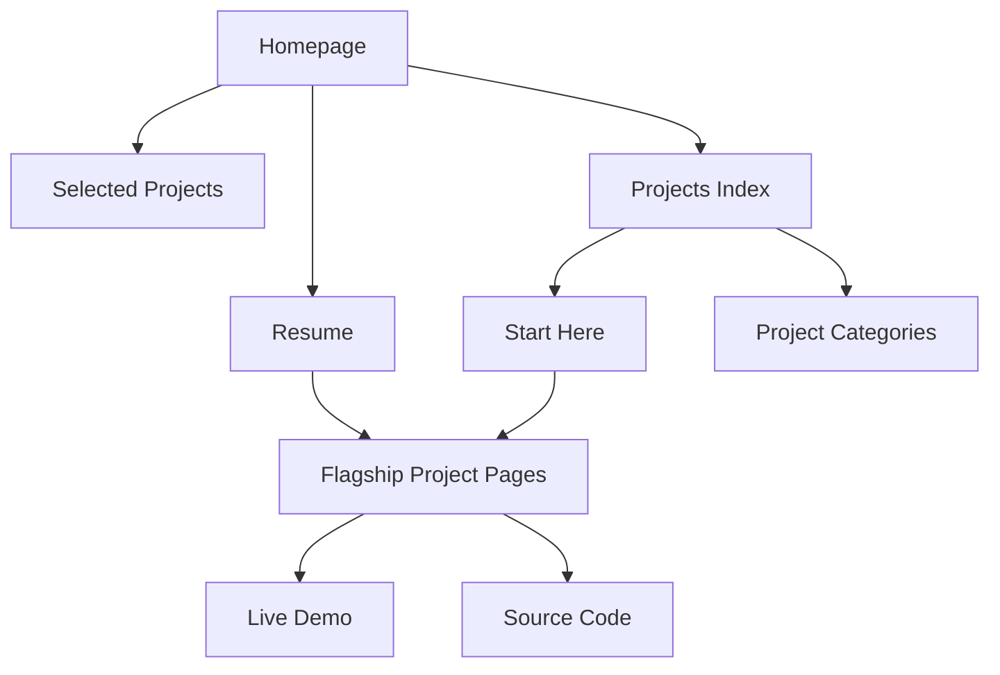

# Portfolio Website Systems Specification

## Purpose
This site should help a recruiter or hiring manager understand Peter quickly, trust the work, and know where to click next.

Primary outcome:
- increase recruiter conversion for Data Engineer, Analytics Engineer, BI Engineer, and adjacent AI/data workflow roles

Secondary outcome:
- preserve personality and range without muddying role fit

---

## Primary audiences
1. Recruiters scanning in under 30 seconds
2. Hiring managers evaluating project depth
3. Technical interviewers looking for end-to-end system thinking
4. Curious humans who may appreciate the more creative/project side

---

## Core positioning
Peter should read primarily as:
- Data Engineer
- Analytics / Decision-Support Systems Builder
- AI / Retrieval Workflow Builder

Supporting strengths:
- D3 / interactive storytelling
- systems thinking
- product instinct
- creative front-end experimentation

---

## Site architecture

```text
Home
├─ Hero / positioning
├─ Quick fit cards
├─ Skills overview
├─ Selected projects
└─ Live projects

Projects
├─ Start here (recruiter-first)
├─ Data Engineering & AI Workflows
├─ Analytics & Decision Support
├─ Quant & Modeling
├─ D3 & Interactive Storytelling
└─ Creative / Product Experiments

Project Detail Pages
├─ Summary
├─ Action buttons (live/demo)
├─ Stack / impact metadata
└─ Short case-study body

About
└─ Professional throughline + fit

Resume
├─ Best-fit roles
├─ Recommended project links
└─ PDF resume
```

---

## Navigation logic
- Home should answer: who is this, what does he build, where should I click?
- Projects should answer: what are the strongest proof points first?
- About should answer: why is this background coherent?
- Resume should answer: what roles fit best and what projects should I open next?

---

## Homepage responsibilities
The homepage should do five things fast:
1. Position Peter clearly
2. Make role fit obvious
3. Show strongest proof first
4. Preserve some personality
5. Offer clear next clicks

### Homepage sections
#### 1. Hero
- one clear headline
- one practical subheadline
- CTA to projects and resume

#### 2. Quick-fit cards
- What I build
- How I work
- Best fit
- What stands out

#### 3. Skills overview
Should not feel like a generic buzzword matrix.
Should reinforce the real throughline:
- Data Pipelines
- AI & Retrieval Workflows
- Analytics & Decision Support
- Interactive Data Products

#### 4. Selected projects
These should be the strongest hiring-signal projects first.

Recommended order:
1. Obsidian RAG Chat
2. End-to-end AI pipeline for operational insights
3. GovCon analytics dashboard for mission KPIs
4. NOVA Data Center Energy
5. Beltway Realms Card Database

#### 5. Live projects
Blurbs should explain engineering value, not just topic/theme.

---

## Project detail page design principles
Current direction should remain compact.
Project pages should not read like essays.

Each project page should include:
- title
- one-sentence summary
- live/demo button if available
- stack / impact metadata
- 3 compact sections max:
  - What I built
  - Why it matters
  - What this project shows

### Avoid
- giant architecture dumps unless they are genuinely helpful
- long autobiographical explanation
- too many headings
- repeated “this shows…” phrasing across every page in the same cadence

### Good project page feel
More like:
- concise case study
Less like:
- blog post
- README dump
- consultant whitepaper

---

## Content model
Each project should support:
- `title`
- `type`
- `template`
- `summary`
- `tags`
- `stack`
- `impact`
- `liveUrl` (optional)
- `legacyUrl` (optional)

### Rule
If a project has a live demo, show a button near the top.
If it has only a legacy/live external page, expose that clearly.
If neither exists, do not fake a CTA.

---

## “Start here” logic
The Projects page should continue using a recruiter-first highlight section.

Criteria for inclusion:
- strongest hiring signal
- best combination of clarity + execution
- role relevance
- enough proof to feel real

This section is not “most fun projects.”
It is “best first projects for evaluation.”

---

## Link strategy
### Must-have links
- project detail pages should show live/demo links when available
- resume page should link to top proof projects
- homepage and projects page should direct people toward strongest artifacts first

### Missing-link rule
If a highlighted project has no live URL yet:
- create a local stub folder for future work
- treat it as a build target, not a pretend finished project

Current desktop stub targets:
- `~/Desktop/project-stubs/ai-pipeline-operational-insights`
- `~/Desktop/project-stubs/govcon-analytics-dashboard`

---

## Tone rules
The site should feel:
- sharp
- grounded
- technically credible
- human
- slightly distinctive

Avoid:
- inflated AI language
- enterprise mush
- trying to sound like five personas at once
- hiding personality completely

---

## Implementation priorities
### Phase 1
- homepage clarity
- featured project order
- shorter flagship project pages
- live/demo buttons near top of detail pages

### Phase 2
- tighten repetition across all project pages
- improve visual hierarchy on detail pages
- ensure all metadata is consistent

### Phase 3
- create real implementations for missing-link highlighted projects
- likely starting with:
  - AI pipeline for operational insights
  - GovCon analytics dashboard

---

## Next build targets
1. Review flagship pages in browser for length and scannability
2. Decide whether to simplify project-page templates further
3. Start building actual repos/prototypes for missing highlighted projects
4. Add source-code links consistently where appropriate

---

## Simple component interaction diagram



## Decision rule for future edits
When in doubt, prefer:
- clearer role fit
- shorter project pages
- stronger proof
- fewer words
- real links
over
- broader identity
- more explanation
- more categories
- more “interesting” but lower-signal content
